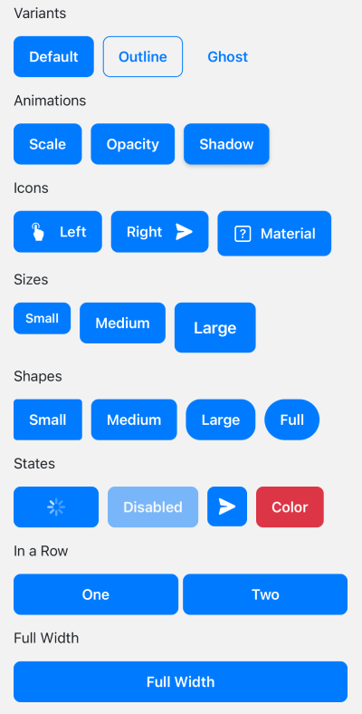
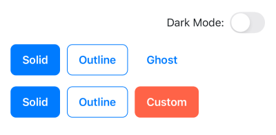
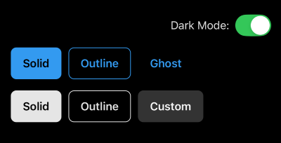

# Button

The `Button` component is a styled, theme-aware wrapper around **React Native’s** `Pressable` and `Text`.
It provides consistent design across your app with support for variants, sizes, shapes, loading states, and icons — all integrated with your theme.

## ✨ Why use the `Button` component?

React Native provides a very basic `Button` component, but it is limited in styling — offering only simple text and color options. This often leads developers to create ad-hoc custom buttons for each screen, which results in inconsistent padding, shapes, and interactions across the app.

Our `Button` component solves this by:

- ✅ **Consistent Styling** – Define colors, sizes, and shapes in the theme.
- ✅ **Style Variants** – Supports solid, outline, and ghost buttons for flexible design.
- ✅ **Theme Integration** – Adapts to light/dark themes or custom color palettes.
- ✅ **Built-in States** – Loading and disabled states included out of the box.
- ✅ **Icon Support** – Easily add left/right icons for richer UI.
- ✅ **Extendable** – Customize globally via `ThemeProvider` or per-button as needed.


## 📦 Usage Examples

**Basic**

```tsx
import { Image } from "react-native";
import { Button, ThemeProvider } from "@geekyhawks/react-native-ui-components";
import { MaterialIcons } from "@react-native-vector-icons/material-icons";

export default function Example() {
  return (
    <ThemeProvider>
      {/* Button Variants */}
      <Button onPress={() => console.log("Pressed!")}>Default</Button>
      <Button variant="outline" onPress={() => console.log("Pressed!")}>Outline</Button>
      <Button variant="ghost" onPress={() => console.log("Pressed!")}>Ghost</Button>

      {/* Button Animations */}
      <Button animation="scale" onPress={() => console.log("Pressed!")}>Scale</Button>
      <Button animation="opacity" onPress={() => console.log("Pressed!")}>Opacity</Button>
      <Button animation="shadow" onPress={() => console.log("Pressed!")}>Shadow</Button>
      <Button animation="scaleOpacity" onPress={() => console.log("Pressed!")}>Scale Opacity</Button>

      {/* Full Width Button */}
      <Button fullWidth onPress={() => console.log("Pressed!")}>Full Width</Button>

      {/* Button with Size, Shape and colorScheme */}
      <Button size="lg" shape="full" colorScheme="secondary" onPress={() => console.log("Pressed!")}>Large</Button>

      {/* Buttons with Icons */}
      <Button
        leftIcon={
          <MaterialIcons name="home" color="white" size={20} />
        }
      >
        Left Icon
      </Button>
      <Button
        rightIcon={
          <Image
            source={require("../../assets/send.png")}
            style={{ width: 20, height: 20, marginLeft: 6 }}
          />
        }
        onPress={() => console.log("Pressed!")}
      >
        Right Icon
      </Button>

      {/* Button with Loading state */}
      <Button loading onPress={() => console.log("Pressed!")}>Loading</Button>

      {/* Disabled Button */}
      <Button disabled onPress={() => console.log("Pressed!")}>Disabled</Button>

      {/* Icon only Button */}
      <Button
        leftIcon={
          <Image
            source={require("../../assets/send.png")}
            style={{ width: 20, height: 20 }}
          />
        }
        onPress={() => console.log("Pressed!")}>
      </Button>
    </ThemeProvider>
  );
}
```

**Light / Dark Theme**

```tsx
import { useColorScheme } from "react-native";
import { defaultDarkTheme, defaultLightTheme, Button, ThemeProvider } from "@geekyhawks/react-native-ui-components";

export default function Example() {
  const isDarkMode = useColorScheme() === "dark";

  return (
    <ThemeProvider theme={isDarkMode ? defaultDarkTheme : defaultLightTheme}>
      {/* Default Button, Solid variant  */}
      <Button>Solid</Button>

      {/* Outline Button */}
      <Button variant="outline">Outline</Button>

      {/* Ghost Button */}
      <Button variant="ghost">Ghost</Button>

      {/* Change color scheme for solid button */}
      <Button colorScheme={isDarkMode ? "text" : "primary"}>Solid</Button>

      {/* Change containerStyle, textStyle */}
      <Button
        containerStyle={{ backgroundColor: isDarkMode ? "#333333" : "#FF6347" }}
        textStyle={{ color: isDarkMode ? "#FAFAFA" : "#ffffff" }}>
        Custom
      </Button>
    </ThemeProvider>
  );
}
```


## 📱 Screenshots

| Buttons | Light Mode | Dark Mode |
|----------|----------|----------|
|  |  |  |


## 📱 Live Example

For a full showcase of all button variants, sizes, shapes, and states, check out the [ButtonDemoScreen](https://github.com/GeekyHawks/react-native-ui-components/blob/main/example/src/screens/ButtonDemoScreen.tsx) inside the **Example App**.

This screen demonstrates how all props work together in a real-world context.


## 🔧 Props

| Prop                  | Type                                                                   | Default       | Description                                                                                  |
| --------------------- | ---------------------------------------------------------------------- | ------------- | -------------------------------------------------------------------------------------------- |
| `accessibilityHint`   | `string`                                                               | —             | Accessibility hint for screen readers.                                                       |
| `accessibilityLabel`  | `string`                                                               | —             | Accessibility label for screen readers.                                                      |
| `animation`           | `"scale" \| "opacity" \| "shadow" \| "scaleOpacity" \| "none"`         | `"scale"`     | Animation effect on press.                                                                   |
| `buttonStyle`         | `StyleProp<ViewStyle>`                                                 | —             | Style for the inner button surface (background color, border radius, shadow, padding, etc.). |
| `children`            | `React.ReactNode`                                                      | —             | Button label or content.                                                                     |
| `colorScheme`         | `keyof ReturnType<typeof useTheme>["theme"]["colors"]`                 | `"primary"`   | Color scheme from theme (extendable via theme).                                              |
| `containerStyle`      | `StyleProp<ViewStyle>`                                                 | —             | Custom style for the outer container (layout-related styles like flex, margin, alignment).   |
| `disabled`            | `boolean`                                                              | `false`       | Disables the button.                                                                         |
| `fontFamily`          | `string`                                                               | Theme default | Optional font family for the button text.                                                    |
| `fullWidth`           | `boolean`                                                              | `false`       | Makes the button stretch to full container width.                                            |
| `leftIcon`            | `React.ReactNode`                                                      | —             | Icon or element on the left.                                                                 |
| `leftIconStyle`       | `StyleProp<ViewStyle>`                                                 | —             | Style override for the left icon container.                                                  |
| `loading`             | `boolean`                                                              | `false`       | Shows loading state.                                                                         |
| `loadingIndicator`    | `React.ReactNode`                                                      | —             | Custom loading indicator (replaces default spinner).                                         |
| `loadingText`         | `string`                                                               | —             | Optional text displayed alongside the loading indicator.                                     |
| `loadingTextPosition` | `"left"` \| `"right"`                                                  | `"right"`     | Position of the loading text relative to the loading indicator.                              |
| `loadingTextStyle`    | `StyleProp<TextStyle>`                                                 | —             | Custom style for the loading text.                                                           |
| `onPress`             | `(event: GestureResponderEvent) => void`                               | —             | Callback when button is pressed.                                                             |
| `rightIcon`           | `React.ReactNode`                                                      | —             | Icon or element on the right.                                                                |
| `rightIconStyle`      | `StyleProp<ViewStyle>`                                                 | —             | Style override for the right icon container.                                                 |
| `shape`               | `DefaultButtonShapes \| (string & {})` <br> *(sm \| md \| lg \| full)* | `"md"`        | Button shape (predefined or custom).                                                         |
| `size`                | `DefaultButtonSizes \| (string & {})` <br> *(sm \| md \| lg)*          | `"md"`        | Button size (predefined or custom).                                                          |
| `textStyle`           | `StyleProp<TextStyle>`                                                 | —             | Custom style override for the button text.                                                   |
| `variant`             | `"solid" \| "outline" \| "ghost"`                                      | `"solid"`     | Button style variant.                                                                        |
| `...props`            | `PressableProps`                                                       | —             | All native RN `Pressable` props.                                                             |


## 🎨 Variants & Theming

Button Style, Size and Shape Variants come from your theme configuration, ensuring consistent typography and styles across the app.

### 1. Style Variants

Control the visual style of the button itself. Available options are:

- **solid** → A filled button with background color (primary by default).
- **outline** → Transparent background with a themed border.
- **ghost** → Minimal button with no border and transparent background.

Example

```tsx
<Button variant="solid">Solid Button</Button>
<Button variant="outline">Outline Button</Button>
<Button variant="ghost">Ghost Button</Button>
```

### 2. Size Variants

Control the overall padding and font size of the button.

#### Default Button Size Variants

By default, the library ships with a set of default button size variants:

```tsx
export const defaultButtonSizeVariants: ButtonSizeVariants = {
    sm: {
        container: { paddingVertical: 8, paddingHorizontal: 12 },
        text: { fontSize: 14 },
        iconOnlyContainer: { width: 36, height: 36, borderRadius: 18 },
    },
    md: {
        container: { paddingVertical: 12, paddingHorizontal: 16 },
        text: { fontSize: 16 },
        iconOnlyContainer: { width: 44, height: 44, borderRadius: 22 },
    },
    lg: {
        container: { paddingVertical: 16, paddingHorizontal: 20 },
        text: { fontSize: 18 },
        iconOnlyContainer: { width: 52, height: 52, borderRadius: 26 },
    },
};
```

You can use them directly:

```tsx
<Button size="sm">Small Button</Button>
<Button size="lg">Large Button</Button>
```

### 3. Shape Variants

Control the border radius of the button.

#### Default Button Shape Variants

By default, the library ships with a set of default button shape variants:

```tsx
export const defaultButtonShapeVariants: ButtonShapeVariants = {
    sm: { borderRadius: 4 },
    md: { borderRadius: 8 },
    lg: { borderRadius: 16 },
    full: { borderRadius: 9999 },
};
```

You can use them directly:

```tsx
<Button shape="sm">Small Radius Button</Button>
<Button shape="full">Full Radius Button</Button>
```

### 🔧 Customizing Variants

You’re not limited to the defaults — you can extend them or define your own completely:

#### Extend Default Variants

```tsx
const customButtonSizeVariants: ButtonSizeVariants = {
  ...defaultButtonSizeVariants,  // extend existing ones
  xl: { paddingVertical: 16, paddingHorizontal: 28, fontSize: 20 },
};
```

Then you can use:

```tsx
import { Button, ThemeProvider } from "@geekyhawks/react-native-ui-components";

export default function Example() {
  return (
    <ThemeProvider buttonSizeVariants={customButtonSizeVariants}>
      <Button size="xl">XL Button</Button>
    </ThemeProvider>
  );
}
```

#### Custom Variants

```tsx
const customButtonShapeVariants: ButtonShapeVariants = {
    sm: { borderRadius: 8 },
    md: { borderRadius: 12 },
    lg: { borderRadius: 20 },
    xl: { borderRadius: 24 },
    full: { borderRadius: 9999 },
};
```

Then you can use:

```tsx
import { Button, ThemeProvider } from "@geekyhawks/react-native-ui-components";

export default function Example() {
  return (
    <ThemeProvider buttonShapeVariants={customButtonShapeVariants}>
      <Button shape="xl">XL Radius Button</Button>
    </ThemeProvider>
  );
}
```


## 📓 Notes

- Theming ensures your app’s buttons look and behave consistently across all screens.  
- Especially useful in large projects with multiple developers, preventing ad-hoc button styles.  
- You can still pass all regular React Native `Pressable` props like `onPress`, `disabled`, `testID`, etc.  
- Supports icons and loading states without needing extra wrappers.  
