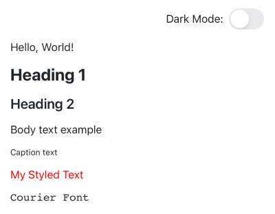
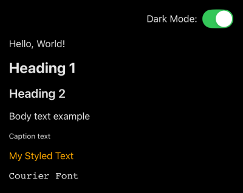

# Text

The `Text` component is a styled and theme-aware wrapper around React Native’s native `Text`.  
It ensures **consistent typography, font sizes, and colors across the app**, while still allowing full customization when needed.

## ✨ Why use the `Text` component?

Using plain React Native `Text` everywhere often leads to inconsistent font sizes, weights, and colors across screens.  

Our `Text` component solves this by:

- ✅ **Centralized Typography** – Define all text sizes, weights, and colors in the theme.
- ✅ **Custom Fonts** – Apply your brand fonts globally without redefining in every component.
- ✅ **Variants for Consistency** – Use predefined variants (`h1`, `h2`, `body`, `caption`) instead of manually styling.
- ✅ **Theme Integration** – Automatically adapts to light/dark themes or any custom theme setup.
- ✅ **Extendable** – Easily add your own variants (e.g., `subtitle`, `overline`, `quote`) via theme overrides.


## 📦 Usage Examples

**Basic**

```tsx
import { Text, ThemeProvider } from "@geekyhawks/react-native-ui-components";

export default function Example() {
  return (
    <ThemeProvider>
      <Text>Hello World</Text>
      <Text variant="h1">Heading</Text>
      <Text color="red">Color Prop</Text>
      <Text fontFamily="Courier">Courier Font</Text>
      <Text style={{ color: "purple", fontSize: 28, fontWeight: "bold" }}>Styled Text</Text>
    </ThemeProvider>
  );
}
```

**Light / Dark Theme**

```tsx
import { useColorScheme } from "react-native";
import { defaultDarkTheme, defaultLightTheme, Text, ThemeProvider } from "@geekyhawks/react-native-ui-components";

export default function Example() {
  const isDarkMode = useColorScheme() === "dark";

  return (
    <ThemeProvider theme={isDarkMode ? defaultDarkTheme : defaultLightTheme}>
      <Text variant="h1">Heading</Text>
      <Text color={isDarkMode ? "#FFAA00" : "#FF0000"}>My Styled Text</Text>
    </ThemeProvider>
  );
}
```


## 📱 Screenshots

| Light Mode | Dark Mode |
|----------|----------|
|  |  |


## 📱 Live Example

For a full showcase of all text variants, sizes, and weights, check out the [TextDemoScreen](https://github.com/GeekyHawks/react-native-ui-components/blob/main/example/src/screens/TextDemoScreen.tsx) inside the **Example App**.

This screen demonstrates how all props work together in a real-world context.


## 🔧 Props


| Prop         | Type                 | Default       | Description                                                                |
| ------------ | -------------------- | ------------- | -------------------------------------------------------------------------- |
| `children`   | `React.ReactNode`    | —             | Text content.                                                              |
| `color`      | `string`             | Theme default | Text color, overrides theme.                                               |
| `fontFamily` | `string`             | Theme default | Font family applied to the text.                                           |
| `style`      | `TextStyle`          | —             | Custom style override.                                                     |
| `variant`    | `keyof TextVariants` | `"body"`      | Predefined text style (from theme). `"h1"`, `"h2"`, `"body"`, `"caption"`. You can also extend the theme with custom variants and pass their keys here. |
| `...props`   | All RN `Text` props  | —             | Any additional native Text props.                                          |


## 🎨 Variants

Variants come from your theme configuration, ensuring consistent typography and styles across the app.

### Default Text Variants

By default, the library ships with a set of default text variants:

```tsx
export const defaultTextVariants: TextVariants = {
    body: { fontSize: 16 },
    h1: { fontSize: 24, fontWeight: "700" },
    h2: { fontSize: 20, fontWeight: "600" },
    caption: { fontSize: 12 },
};
```

You can use them directly:

```tsx
<Text variant="h1">Main Heading</Text>
<Text variant="body">Regular paragraph text goes here</Text>
<Text variant="caption">Small helper note</Text>
```

### 🔧 Customizing Variants

You’re not limited to the defaults — you can extend them or define your own completely:

#### Extend Default Variants

```tsx
const textVariants: TextVariants = {
  ...defaultTextVariants, // extend existing ones
  h3: { fontSize: 18, fontWeight: "500", fontFamily: "Inter-Medium" },
  subtitle: { fontSize: 14, fontWeight: "400", color: "#666" },
};
```

#### Custom Variants

```tsx
const customTextVariants: TextVariants = {
  h1: { fontSize: 32, fontWeight: "700", fontFamily: "Inter-Bold" },
  h2: { fontSize: 24, fontWeight: "600", fontFamily: "Inter-SemiBold" },
  body: { fontSize: 16, fontWeight: "400", fontFamily: "Inter-Regular" },
  caption: { fontSize: 12, fontWeight: "400", fontFamily: "Inter-Regular", color: "#999" },
  subtitle: { fontSize: 18, fontWeight: "500", fontFamily: "Inter-Medium" },
  quote: { fontSize: 16, fontStyle: "italic", color: "#666" },
};
```

Then you can use:

```tsx
import { Text, ThemeProvider } from "@geekyhawks/react-native-ui-components";

export default function Example() {
  return (
    <ThemeProvider textVariants={customTextVariants}>
      <Text variant="h1">Main Heading</Text>
      <Text variant="caption">Small helper note</Text>
      <Text variant="subtitle">Subtitle Text</Text>
      <Text variant="quote">Quote</Text>
    </ThemeProvider>
  );
}
```


## 📓 Notes

- Theming ensures your app’s typography is consistent everywhere.
- Ideal for large projects where multiple developers work on the same UI.
- You can still pass all regular React Native Text props like onPress, selectable, etc.
